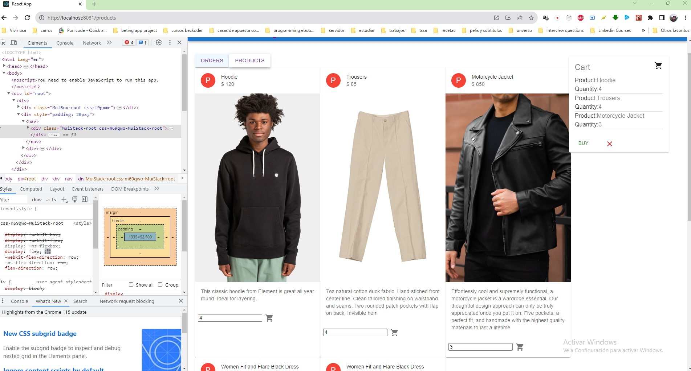
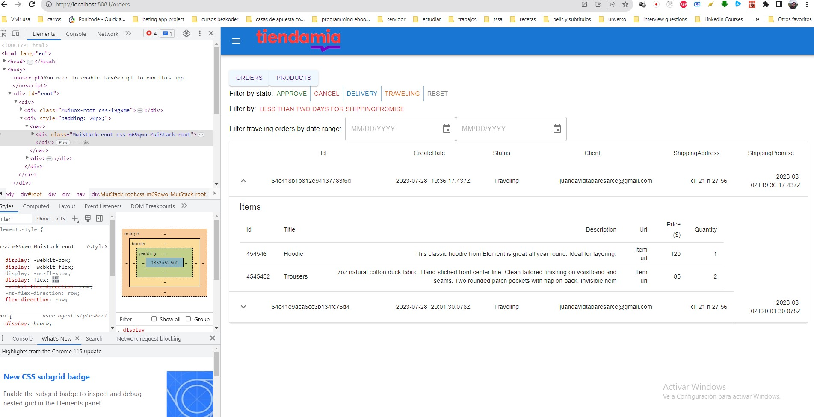

# React Typescript with API call example using Hooks and Axios for Tiendama
A React Typescript CRUD Application to consume Web API with Hooks and Axios, display and modify data with Router & Material-ui.

### General view




### Set port
.env
```
PORT=8081
```

## Project setup

In the project directory, you can run:

```
yarn
```

or

### Compiles and hot-reloads for development

```
yarn start
yarn test
yarn build
```

Open [http://localhost:8081](http://localhost:8081) to view it in the browser.

The page will reload if you make edits.

Notes:
I did not use react-context or redux since the relationship between parents are child have only one level.
